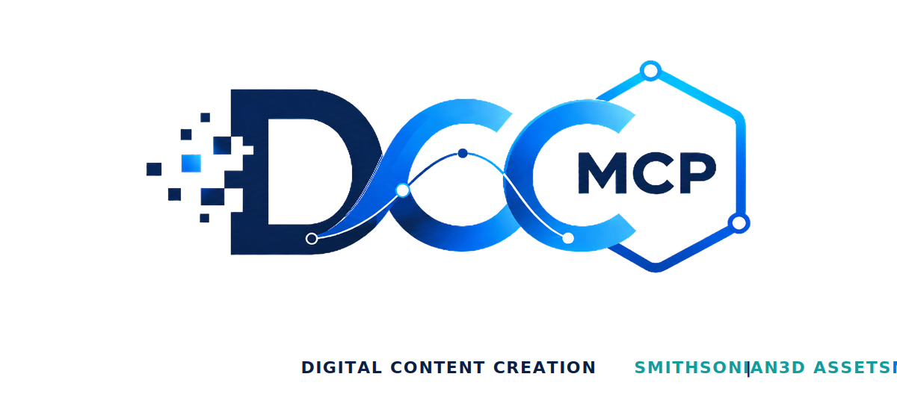
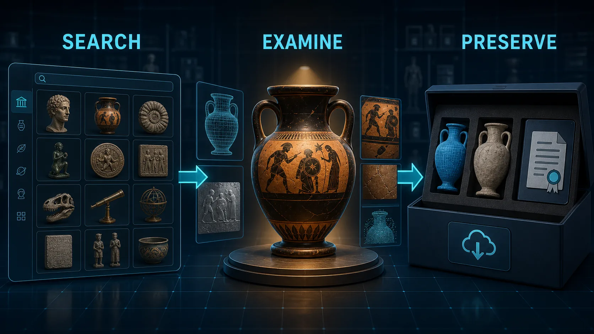

# DCC-MCP Smithsonian 3D Assets

<p align="center">
  
</p>

## Agent workflow

AI agents should use installed package skills through the shared gateway. IDE
users may continue to use the MCP endpoint.

```bash
dcc-mcp-cli dcc-types
dcc-mcp-cli list
dcc-mcp-cli search --query "<task>" --dcc-type <host>
dcc-mcp-cli describe <tool-slug>
dcc-mcp-cli call <tool-slug> --json '{"key":"value"}'
```

If the package skill is not active, call
`dcc-mcp-cli load-skill <skill-name> --dcc-type <host>`. After the task,
query `dcc-mcp-cli stats --range 24h --session-id <task-id>` and pass only
bounded evidence to the `review_skill_improvement` prompt from
`dcc-mcp-skills-creator`.




Search and download Smithsonian Open Access 3D files from the public S3 mirror
and Smithsonian 3D API document endpoint.

## Install

```bash
dcc-mcp-cli marketplace add dcc-mcp/dcc-asset-smithsonian3d
dcc-mcp-cli marketplace install dcc-asset-smithsonian3d
```

## License And Usage

Smithsonian Open Access assets are published under CC0. The Smithsonian Open
Access FAQ says CC0 items are dedicated into the public domain and may be used
for any purpose without further permission.

This skill returns `license_name` and `license_url` in results. Keep that
metadata with downloaded files.

## Tools

- `search_smithsonian3d_files`
- `list_smithsonian3d_document`
- `download_smithsonian3d_file`

